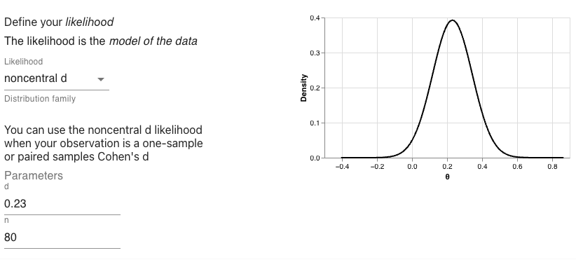
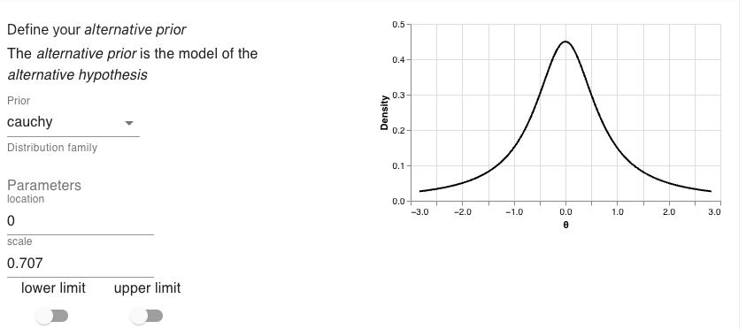
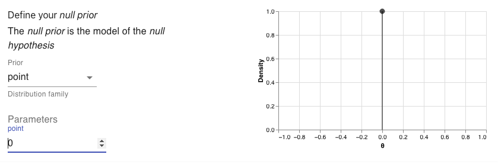
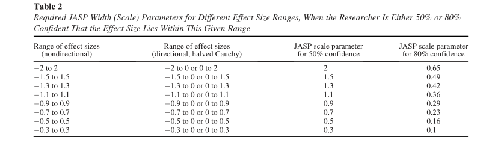
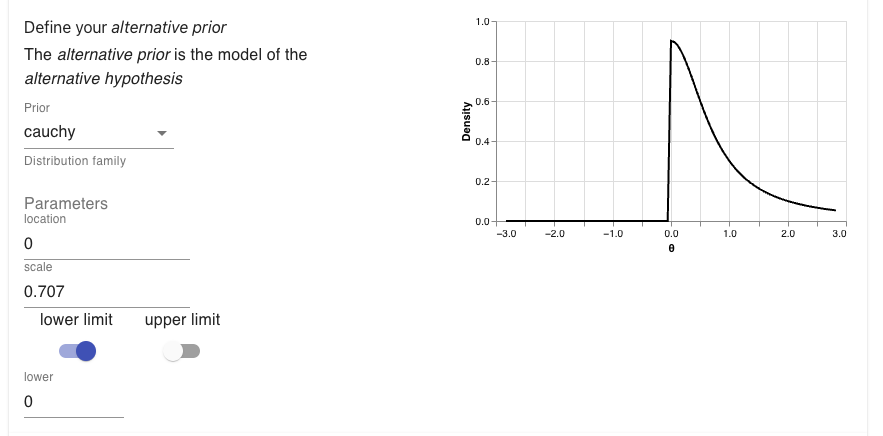

```{r setup, echo=FALSE, message = FALSE, warning = FALSE}
knitr::opts_chunk$set(echo = FALSE, message = FALSE, warning = FALSE)
suppressMessages(expr = {
  if ("xfun" %in% row.names(installed.packages()) == FALSE) {
    install.packages("xfun")
  }

  display_markdown <<- knitr::asis_output
  display_html <<- knitr::asis_output

  xfun::pkg_attach(
    c(
      "tidyverse",
      "polspline",
      "patchwork",
      "magrittr",
      "bayesplay",
      "knitr",
      "broom",
      "bayesplay"
    ),
    install = TRUE
  )
})

table_format <- "html"
```
# Choosing priors
<a href="data:text/x-markdown;base64,LS0tCnRpdGxlOiAiUHJpb3JzOiBQYXJ0IDEiCm91dHB1dDogaHRtbF9kb2N1bWVudAotLS0KCmBgYHtyIHNldHVwLCBlY2hvPUZBTFNFLCBtZXNzYWdlID0gRkFMU0UsIHdhcm5pbmcgPSBGQUxTRX0Ka25pdHI6Om9wdHNfY2h1bmskc2V0KGVjaG8gPSBGQUxTRSwgbWVzc2FnZSA9IEZBTFNFLCB3YXJuaW5nID0gRkFMU0UpCnN1cHByZXNzTWVzc2FnZXMoZXhwciA9IHsKICBpZiAoInhmdW4iICVpbiUgcm93Lm5hbWVzKGluc3RhbGxlZC5wYWNrYWdlcygpKSA9PSBGQUxTRSkgewogICAgaW5zdGFsbC5wYWNrYWdlcygieGZ1biIpCiAgfQoKICBkaXNwbGF5X21hcmtkb3duIDw8LSBrbml0cjo6YXNpc19vdXRwdXQKICBkaXNwbGF5X2h0bWwgPDwtIGtuaXRyOjphc2lzX291dHB1dAoKICB4ZnVuOjpwa2dfYXR0YWNoKAogICAgYygKICAgICAgInRpZHl2ZXJzZSIsCiAgICAgICJwb2xzcGxpbmUiLAogICAgICAicGF0Y2h3b3JrIiwKICAgICAgIm1hZ3JpdHRyIiwKICAgICAgImJheWVzcGxheSIsCiAgICAgICJrbml0ciIsCiAgICAgICJicm9vbSIsCiAgICAgICJiYXllc3BsYXkiCiAgICApLAogICAgaW5zdGFsbCA9IFRSVUUKICApCn0pCgp0YWJsZV9mb3JtYXQgPC0gImh0bWwiCmBgYAojIENob29zaW5nIHByaW9ycwoKSW4gdGhlIHByZXZpb3VzIHNlY3Rpb24sIHdlIGxlYXJuZWQgaG93IHdlIGNhbiB1c2Ugbm9ybWFsLCBzdHVkZW50ICp0KiwKYW5kIHZhcmlvdXMga2luZHMgb2YgKm5vbi1jZW50cmFsIHQqIGxpa2VsaWhvb2RzIHRvIG1vZGVsIG1lYW5zLCBtZWFuCmRpZmZlcmVuY2VzLCBhbmQgZWZmZWN0IHNpemVzLiBCdXQgaWYgd2UgYWN0dWFsbHkgd2FudCB0byBjb21wdXRlIEJheWVzCmZhY3RvcnMgdGhlbiB3ZSdsbCBhbHNvIG5lZWQgdG8gZGVmaW5lICoqcHJpb3JzKiouIFdoaWxlIHRoZQoqKmxpa2VsaWhvb2RzKiogYXJlIGEgbW9kZWwgb2Ygb3VyICoqZGF0YSoqIHRoZSAqKnByaW9ycyoqIHdpbGwgc2VydmUgYXMKdGhlIG1vZGVscyBmb3IgdGhlICoqaHlwb3RoZXNlcyoqIHdlIGFjdHVhbGx5IHdhbnQgdG8gY29tcGFyZS4KClRoZXJlIGFyZSB0d28gYnJvYWQgc2Nob29scyBvZiB0aG91Z2h0IHdoZW4gaXQgY29tZXMgdG8gZGVmaW5pbmcgcHJpb3JzLgpUaGUgZmlyc3QgaXMgdG8gY2hvb3NlIHByaW9ycyB0aGF0IGNhbiBiZSB1c2VkIGluIGEgd2lkZSByYW5nZSBvZgpzaXR1YXRpb25zIGFuZCBkb24ndCBuZWVkIHRvIGJlIHRhaWxvcmVkIHRvIHRoZSBzcGVjaWZpY3Mgb2YgdGhlIHNpdHVhdGlvbgphdCBoYW5kLiBUaGlzIGlzIG9mdGVuIGZyYW1lZCBpbiB0ZXJtcyBvZiBzZWxlY3RpbmcgcHJpb3JzIHRoYXQgYXJlbid0CmRlcGVuZGVudCBvbiB0aGUgaW5kaXZpZHVhbCBiZWxpZWZzIG9yIHRoZW9yaWVzIG9mIGEgc3BlY2lmaWMgcmVzZWFyY2hlciwKb3IgcHJpb3JzIHRoYXQgcmVwcmVzZW50IGlnbm9yYW5jZSBhYm91dCBhbnkgcG9zc2libGUgZWZmZWN0LiBUaGVzZSBhcmUKc29tZXRpbWVzIGNhbGxlZCBvYmplY3RpdmUsIHJlZmVyZW5jZSwgdW5pbmZvcm1hdGl2ZSwgb3IgZGVmYXVsdCBwcmlvcnMKKHRoZXNlIHRlcm1zIGFyZW4ndCBleGFjdGx5IHN5bm9ueW1vdXMsIGJ1dCBmb3Igb3VyIHB1cnBvc2VzIHRoZSB0ZWNobmljYWwKZGlmZmVyZW5jZXMgd29uJ3QgbWF0dGVyKS4gCgpUaGUgc2Vjb25kIGFwcHJvYWNoIGlzIHRvIGNob29zZSBwcmlvcnMgdGhhdCBhcmUgc3BlY2lmaWMgdG8gdGhlIHNpdHVhdGlvbgphdCBoYW5kLiBUaGlzIG1pZ2h0IGJlIGJ5IHNlbGVjdGluZyBwcmlvcnMgdGhhdCByZXByZXNlbnQgYWN0dWFsCnNjaWVudGlmaWMgdGhlb3JpZXMsIHNlbGVjdGluZyBwcmlvcnMgdGhhdCBjb25zdHJhaW4gdGhlIHByZWRpY3RlZCBlZmZlY3RzCnRvIGJlIHdpdGhpbiB0aGUgZXhwZWN0ZWQgcmFuZ2UsIG9yIGNob29zaW5nIHByaW9ycyBiYXNlZCBvbiwgZm9yIGV4YW1wbGUsCnByZXZpb3VzIGV2aWRlbmNlIGFib3V0IHRoZSBuYXR1cmUgb2YgdGhlIGVmZmVjdCBiZWluZyBzdHVkaWVkLiBUaGVzZQpraW5kcyBvZiBwcmlvcnMgZ28gdW5kZXIgdGhlIGxhYmVsIG9mIGluZm9ybWVkLCBvciBzdWJqZWN0aXZlIHByaW9ycy4gSXQKaXMgYWxzbyBpbXBvcnRhbnQgdG8gbm90ZSB0aGF0IHRoZSBsaW5lcyBiZXR3ZWVuIHRoZSB0d28gYXBwcm9hY2hlcyBpcyBub3QKYWx3YXlzIGNsZWFyIGN1dC4gUmF0aGVyLCB0aGV5IGFyZSBvZnRlbiBibHVycmVkLgoKIyMgUmVmZXJlbmNlLCBvYmplY3RpdmUsIHVuaW5mb3JtYXRpdmUsIGFuZCBkZWZhdWx0IHByaW9ycwoKVGhlIG1vc3Qgc3RyYWlnaHRmb3J3YXJkIHdheSB0byBjb21lIHVwIHdpdGggYSBwcmlvciB0aGF0IGNhbiB3b3JrIGluCmEgd2lkZSByYW5nZSBvZiBzaXR1YXRpb25zIGlzIHRvIHVzZSB0aGUgKnByaW5jaXBsZSBvZiBpbmRpZmZlcmVuY2UqLiBUaGlzCmlzIHRoZSBhcHByb2FjaCB0aGF0IHdlIHVzZWQgd2hlbiB3ZSB3ZXJlIGNvbWluZyB1cCB3aXRoIG91ciB2ZXJ5IGZpcnN0CnByaW9yIGZvciB0aGUgY29pbiBmbGlwIGV4YW1wbGUuIE91ciByZWFzb25pbmcgd2FzIHJvdWdobHkgYXMgZm9sbG93czoKCi0gSWYgd2UgZG9uJ3Qga25vdyB3aGF0IHRoZSBjb2luIGJpYXMgaXMgKGp1c3QgdGhhdCBpdCBpcyBzb21lIHZhbHVlCiAgYmV0d2VlbiAwIGFuZCAxKSwgdGhlbiB3ZSBoYXZlIG5vIHJlYXNvbiBmb3IgcHJlZGljdGluZyB0aGF0IGFueQogIHBhcnRpY3VsYXIgb3V0Y29tZSAoaS5lLiwgbnVtYmVyIG9mIGhlYWRzIGFmdGVyIGEgcGFydGljdWxhciBudW1iZXIgb2YKICBmbGlwcykgd2lsbCBvY2N1ciBtb3JlIG9mdGVuIHRoYW4gYW55IG90aGVyIHBhcnRpY3VsYXIgb3V0Y29tZS4KCi0gSWYgd2UgZmxpcCB0aGUgY29pbiAkbiQgdGltZXMsIHRoZW4gdGhlcmUgYXJlICRuICsgMSQgcG9zc2libGUKICBvdXRjb21lcy4gVGhlcmVmb3JlLCB3ZSBhc3NpZ24gYSBwcm9iYWJpbGl0eSBvZiAkXGZyYWN7MX17bisxfSQgdG8gZWFjaAogIG91dGNvbWUuIAoKLSBUaGUgcHJpb3IgdGhhdCBmaXRzIHdpdGggdGhpcyBwcmVkaWN0aW9uIGlzIGEgdW5pZm9ybSBwcmlvciBmcm9tIDAgdG8gMS4KClRoZSBpZGVhIGhlcmUgaXMgdGhhdCBpbiBjb21pbmcgdXAgd2l0aCB0aGUgcHJpb3Igd2UncmUgdHJ5aW5nIHRvIG1ha2UgYXMKZmV3IGFzc3VtcHRpb25zIGFzIHBvc3NpYmxlLiBDb21pbmcgdXAgd2l0aCBwcmlvcnMgdGhhdCBtYWtlIGFzIGZldwphc3N1bXB0aW9ucyBhcyBwb3NzaWJsZSBpcyBub3QgYWx3YXlzIHN0cmFpZ2h0Zm9yd2FyZC4gVGhlcmUgYXJlIGEgbnVtYmVyCm9mIHRlY2huaWNhbCBkaWZmaWN1bHRpZXMgdGhhdCBjYW4gYXJpc2Ugd2hlbiBjaG9vc2luZyBwcmlvcnMgdGhhdAoqc2VlbWluZ2x5KiBkb24ndCBtYWtlIGFueSBhc3N1bXB0aW9ucy4gU29tZSBvZiB0aGVzZSBpc3N1ZXMgYXJpc2Ugd2hlbiwKZm9yIGV4YW1wbGUsIGNob29zaW5nIGEgcHJpb3IgdGhhdCBpcyBub24taW5mb3JtYXRpdmUgd2hlbiBhIHF1ZXN0aW9uIGlzCmFza2VkIG9uZSB3YXkgKGZvciBleGFtcGxlLCBhc2tpbmcgYWJvdXQgdGhlICpiaWFzKiBvZiB0aGUgY29pbikgYnV0IHRoZW4KZG9lc24ndCB0dXJuIG91dCB0byBiZSBub24taW5mb3JtYXRpdmUgd2hlbiB0aGUgcXVlc3Rpb24gaXMgYXNrZWQgaW4KYSBkaWZmZXJlbnQsIGJ1dCBlcXVpdmFsZW50IHdheSAoZm9yIGV4YW1wbGUsIGFza2luZyBhYm91dCB0aGUgKmxvZyBvZGRzKgpvZiBvYnRhaW5pbmcgaGVhZHMpLiAKCkJlY2F1c2Ugb2YgdGhlc2UgdGVjaG5pY2FsIGRpZmZpY3VsdGllcywgcGVvcGxlIGhhdmUgY29tZSB1cCB3aXRoIHJ1bGVzCmZvciBjaG9vc2luZyBwcmlvcnMgdGhhdCBtYWtlIGFzIGZldyBhc3N1bXB0aW9ucyBhcyBwb3NzaWJsZS4gT25jZSBzdWNoCnJ1bGUgaWYgSmVmZnJleSdzIHJ1bGUuIEEgZGV0YWlsZWQgdHJlYXRtZW50IGlzIEplZmZyZXkncyBydWxlIGlzIG91dHNpZGUKdGhlIHNjb3BlIG9mIHRoaXMgY291cnNlLCBidXQgaXQgaXMgaW50ZXJlc3RpbmcgdG8gbm90ZSB0aGF0IEplZmZyZXkncwpydWxlIHJlbGllcyBvbiB0aGUgKnJlYWxtIG9mIHBvc3NpYmxlIGV2ZW50cyogKHRoZSBzYW1lIHRoaW5nIHRoYXQgY2F1c2VkCm91ciB3b3JyaWVzIGFib3V0ICpwKi12YWx1ZXMgYmVpbmcgaW1wYWN0ZWQgYnkgZGlmZmVyZW50IHNhbXBsaW5nIHJ1bGVzKS4gCgojIyMgRGVmYXVsdCBwcmlvcnMgZm9yIGVmZmVjdCBzaXplcwoKQW5vdGhlciBtZXRob2QgZm9yIGRlZmluaW5nICoqb2JqZWN0aXZlKiogcHJpb3JzIHRoYXQgaGFzIGJlZW4KcGFydGljdWxhcmx5IHBvcHVsYXIgd2l0aGluIHBzeWNob2xvZ3kgaGFzIGJlZW4gdG8gdXNlICoqZGVmYXVsdCBwcmlvcnMqKi4KVGhlIG1vc3QgcHJvbWluZW50IGV4YW1wbGUgb2YgdGhpcyBhcHByb2FjaCBoYXMgYmVlbiB0aGUgdXNlIG9mICoqZGVmYXVsdApwcmlvcnMqKiBmb3IgZWZmZWN0IHNpemVzLS0tdGhlIHNvLWNhbGxlZCAqZGVmYXVsdCBCYXllc2lhbiB0LXRlc3QqClsoUm91ZGVyIGV0IGFsLAoyMDA5KV0oaHR0cDovL3BjbC5taXNzb3VyaS5lZHUvc2l0ZXMvZGVmYXVsdC9maWxlcy9Sb3VkZXIuYmZfLnBkZikuCgpUaGUgKmRlZmF1bHQgQmF5ZXNpYW4gdC10ZXN0KiBjYW4gYmUgdXNlZCBhbnl3aGVyZSB3aGVyZSBhIHJlZ3VsYXIKZnJlcXVlbnRpc3QgKnQqLXRlc3QgY2FuIGJlIHVzZWQuIEZvciB0aGUgZGVmYXVsdCBCYXllcyAqdCotdGVzdCwgdGhlIGRhdGEKYXJlIG1vZGVsbGVkIGluIHRlcm1zIG9mIHRoZSBlZmZlY3Qgc2l6ZS4gVGhhdCBpcywgYSAqbm9uLWNlbnRyYWwgZCogb3IKKm5vbi1jZW50cmFsIGQyKiBsaWtlbGlob29kIGlzIHVzZWQgKGRlcGVuZGluZyBvbiB3aGV0aGVyIHRoZSBkYXRhIGFyZQpmcm9tIG9uZS1zYW1wbGUvcGFpcmVkIGRhdGEgb3IgaW5kZXBlbmRlbnQgc2FtcGxlcykuIFRoZXNlIGFyZSB0aGUKbGlrZWxpaG9vZCdzIHRoYXQgd2UgZGVmaW5lZCBuZWFyIHRoZSBlbmQgb2YgdGhlIHByZXZpb3VzIHNlY3Rpb24uCkhvd2V2ZXIsIHdoYXQgcmVhbGx5IGNoYXJhY3RlcmlzZXMgdGhpcyBhcHByb2FjaCBpcyB0aGUgcHJpb3IgdGhhdCBpcwplbXBsb3llZC4gVGhlIGRlZmF1bHQgQmF5ZXMgKnQqLXRlc3QgdXNlcyBhICoqQ2F1Y2h5KiogcHJpb3IuIEEgKipDYXVjaHkqKgpkaXN0cmlidXRpb24gaXMgc2ltaWxhciBpbiBzaGFwZSB0byBhIHN0YW5kYXJkIG5vcm1hbCBkaXN0cmlidXRpb24gKHBhbmVsCkEgYmVsb3cpLCBob3dldmVyIGl0IGhhcyBmYXIgZmF0dGVyIHRhaWxzIChwYW5lbCBCIGJlbG93KS4KCmBgYHtyfQpub3JtYWwgPC0gcHJpb3IoIm5vcm1hbCIsIDAsIDEpCmNhdWNoeSA8LSBwcmlvcigiY2F1Y2h5IiwgMCwgMSkKKChwbG90KG5vcm1hbCkgKwogIHRoZW1lX21pbmltYWwoMTQpICsKICBOVUxMKSAvCiAgKHBsb3QoY2F1Y2h5KSArCiAgICB0aGVtZV9taW5pbWFsKDE0KSArCiAgICBOVUxMKSArCiAgcGxvdF9hbm5vdGF0aW9uKHRhZ19sZXZlbHMgPSAiQSIpKQpgYGAKCkZvciBhIG1vcmUgaW4tZGVwdGggZGlzY3Vzc2lvbiBvZiBDYXVjaHkgcHJpb3JzLCBhIHJlY2VudCBwYXBlciBieQpbU2NobWFseiBldCBhbCwgMjAyMV0oaHR0cHM6Ly9vc2YuaW8vNWdlcXQvZG93bmxvYWQpIGlzIGhpZ2hseQpyZWNvbW1lbmRlZC4gV2UnbGwgbGVhcm4gYWJvdXQgdGhlbSBieSBleHBsb3Jpbmcgc29tZSBvZiB0aGVpciBwcm9wZXJ0aWVzCnVzaW5nIGBiYXllc3BsYXlgLiBBcyB5b3UgY2FuIHNlZSBmcm9tIHRoZSBwbG90cyBhYm92ZSwgY29tcGFyZWQgdG8KYSBub3JtYWwgZGlzdHJpYnV0aW9uLCB0aGUgQ2F1Y2h5IGhhcyBmYXIgbGVzcyBtYXNzIGluIHRoZSBtaWRkbGUgb2YgdGhlCmRpc3RyaWJ1dGlvbi4gRm9yIHRoZSBDYXVjaHkgZGlzdHJpYnV0aW9uLCA1MCUgb2YgdGhlIGRpc3RyaWJ1dGlvbiBsaWVzCmJldHdlZW4gLTEgYW5kICsxIHdoaWxlIGZvciB0aGUgbm9ybWFsIGRpc3RyaWJ1dGlvbiA2OCUgb2YgdGhlCmRpc3RyaWJ1dGlvbiBsaWVzIGJldHdlZW4gLTEgYW5kICsxLiAKCldlIGNhbiBkZWZpbmUgYSAqKkNhdWNoeSoqIHByaW9yIHVzaW5nIHRoZSBgcHJpb3JgIGZ1bmN0aW9uIGZyb20KYGJheWVzcGxheWAgYW5kIHNldHRpbmcgdGhlICoqZmFtaWx5KiogdG8gKipjYXVjaHkqKi4gVHdvIG90aGVyIHZhbHVlcyBjYW4KYWxzbyBiZSBzZXQuIFRoZSBmaXJzdCBpcyAqKmxvY2F0aW9uKiogd2hpY2ggZGV0ZXJtaW5lcyB0aGUgY2VudHJlIG9mIHRoZQpkaXN0cmlidXRpb24uIFRoaXMgaGFzIGEgZGVmYXVsdCB2YWx1ZSBvZiAwLiBUaGUgc2Vjb25kIGlzICoqc2NhbGUqKiB3aGljaApjYW4gY2hhbmdlIGhvdyB3aWRlIG9yIG5hcnJvdyB0aGUgZGlzdHJpYnV0aW9uIGlzLiBUaGUgb3JpZ2luYWwgcGFwZXIgYnkKUm91ZGVyIGV0IGFsICgyMDA5KSBzZXQgdGhpcyB2YWx1ZSB0byAxLiBIb3dldmVyLCBub3cgYSB2YWx1ZSBvZgokXGZyYWN7MX17XHNxcnR7Mn19XGFwcHJveDAuNzA3JCBpcyBtb3JlIHR5cGljYWwsIGFuZCB0aGlzIGlzIHRoZSBkZWZhdWx0CnZhbHVlIGluIHRoZWlyIFIgcGFja2FnZSAoY2FsbGVkIGBCYXllc0ZhY3RvcmApLgoKTGV0IHVzIGRlZmluZSBhIENhdWNoeSBwcmlvciB3aXRoIGEgbG9jYXRpb24gb2YgMCwgYW5kIGEgc2NhbGUgb2YgMS4KCmBgYHtyfQojfCBlY2hvID0gVFJVRSwgaW5jbHVkZSA9IFRSVUUKCnN0YW5kYXJkX2NhdWNoeSA8LSBwcmlvcigKICBmYW1pbHkgPSAiY2F1Y2h5IiwKICBsb2NhdGlvbiA9IDAsCiAgc2NhbGUgPSAxCikKYGBgCgpBbmQgbm93IHdlJ2xsIGRlZmluZSBhIENhdWNoeSBwcmlvciB3aXRoIGEgbG9jYXRpb24gb2YgMCwgYW5kIGEgc2NhbGUgb2YgCiRcZnJhY3sxfXtcc3FydHsyfX0kLgoKCmBgYHtyfQojfCBlY2hvID0gVFJVRSwgaW5jbHVkZSA9IFRSVUUKCm1lZGl1bV9jYXVjaHkgPC0gcHJpb3IoCiAgZmFtaWx5ID0gImNhdWNoeSIsCiAgbG9jYXRpb24gPSAwLAogIHNjYWxlID0gMSAvIHNxcnQoMikKKQpgYGAKCgpXaXRoIGJvdGggcHJpb3JzIGRlZmluZWQgd2UgY2FuIHBsb3QgdGhlbSBhYm92ZSBlYWNoIG90aGVyLgoKYGBge3J9CiN8IGVjaG8gPSBUUlVFLCBpbmNsdWRlID0gVFJVRQoKc3RhbmRhcmRfY2F1Y2h5X3Bsb3QgPC0gcGxvdChzdGFuZGFyZF9jYXVjaHkpICsKICB0aGVtZV9taW5pbWFsKDE0KSArCiAgdGhlbWUodGl0bGUgPSBlbGVtZW50X3RleHQoc2l6ZSA9IDgpKSArCiAgbGFicyhzdWJ0aXRsZSA9ICJDYXVjaHkoMCwgMSkiKQoKCm1lZGl1bV9jYXVjaHlfcGxvdCA8LSBwbG90KG1lZGl1bV9jYXVjaHkpICsKICB0aGVtZV9taW5pbWFsKDE0KSArCiAgdGhlbWUodGl0bGUgPSBlbGVtZW50X3RleHQoc2l6ZSA9IDgpKSArCiAgbGFicyhzdWJ0aXRsZSA9ICJDYXVjaHkoMCwgMC43MDcpIikKCgpzdGFuZGFyZF9jYXVjaHlfcGxvdCAvIG1lZGl1bV9jYXVjaHlfcGxvdApgYGAKCkFsdGhvdWdoIHRoZSBtb3RpdmF0aW9uIGJlaGluZCB0aGUgZGVmYXVsdCBCYXllcyAqdCotdGVzdCBpcyB0byBjb21lIHVwCndpdGggb2JqZWN0aXZlIHByaW9ycywgUm91ZGVyIGV0IGFsICgyMDA5KSBhbHNvIG5vdGUgdGhhdCByZS1zY2FsaW5nIHRoZQpwcmlvciB0byBiZSB3aWRlciBvciBuYXJyb3dlciwgZGVwZW5kaW5nIG9uIHRoZSByYW5nZSBvZiBwcmVkaWN0ZWQgZWZmZWN0CnNpemVzLCBjYW4gYmUgYSB3YXkgdG8gKnR1bmUqIHRoZSBwcmlvciB0byB0aGUgcGFydGljdWxhcnMgb2YgdGhlCmV4cGVyaW1lbnQuIEFzIG1lbnRpb25lZCBlYXJsaWVyLCB0aGUgZGl2aWRlIGJldHdlZW4gKipvYmplY3RpdmUqKiBhbmQKKipzdWJqZWN0aXZlKiogcHJpb3JzIGlzIGEgYmx1cnJ5IG9uZS4KCk9uZSBvZiB0aGVzZSBDYXVjaHkgcHJpb3JzIGlzIGdvaW5nIHRvIHJlcHJlc2VudCBvdXIgKmFsdGVybmF0aXZlCmh5cG90aGVzZXMqLCBidXQgd2UgYWxzbyBuZWVkIGEgcHJpb3IgdG8gcmVwcmVzZW50IG91ciAqbnVsbCBoeXBvdGhlc2lzKi4KVG8ga2VlcCB0aGluZ3Mgc2ltcGxlIHdlJ2xsIGp1c3QgdXNlIGEgcG9pbnQgaHlwb3RoZXNpcyBhdCB6ZXJvLgoKTm93IHRoYXQgd2UndmUgZGVjaWRlZCBvbiB0aGUgcHJpb3JzIHdlJ3JlIGdvaW5nIHRvIHVzZSwgd2UgbmVlZCB0byBnZXQgdG8KdGhlIG1vc3QgaW1wb3J0YW50IGJpdCEgVGhlIGRhdGEuIFdlJ2xsIGFuYWx5c2UgdGhlIGRhdGEgZnJvbSB0aGUgcHJldmlvdXMKc2VjdGlvbi4gV2UnbGwgZG8gYm90aCB0aGUgb25lLXNhbXBsZSwgYW5kIHRoZSB0d28tc2FtcGxlIGNhc2UuIFRoaXMgbWVhbnMKdGhhdCB3ZSBjYW4gdXNlIHRoZSBsaWtlbGlob29kcyB0aGF0IHdlIGRlZmluZWQgaW4gdGhlIHByZXZpb3VzIHNlY3Rpb24sCmFuZCB3ZSBqdXN0IG5lZWQgdG8gYWRkIHRoZSBwcmlvcnMuCgpJbiB0aGUgZmlyc3Qgb25lIHNhbXBsZSBjYXNlLCB3ZSBmb3VuZCBhICpkKiBvZiAwLjIzIHdpdGggYSBzYW1wbGUgc2l6ZQpvZiA4MC4gRm9yIG91ciBhbHRlcm5hdGl2ZSBoeXBvdGhlc2lzLCB3ZSdsbCB1c2UgdGhlIG5hcnJvd2VyIENhdWNoeQpkaXN0cmlidXRpb24uIFRoYXQgaXMsIGEgQ2F1Y2h5IHdpdGggYSBsb2NhdGlvbiBvZiAwIGFuZCBhIHNjYWxlIG9mIDAuNzA3LgpBbmQgZm9yIHRoZSBudWxsIGh5cG90aGVzaXMgd2UnbGwgdXNlIGEgcG9pbnQgYXQgMC4gCgpJJ2xsIHVzZSB0aGUgW2JheWVzcGxheSB3ZWItYXBwXShodHRwczovL2JheWVzcGxheS5taW5kc2NpLm5ldCkgdG8gZGVmaW5lCnRoZSBtb2RlbC4gVGhlIHNldHRpbmcncyBhcmUganVzdCBhcyBmb2xsb3dzLgoKRmlyc3QgdGhlIGxpa2VsaWhvb2Q6CgpgYGB7cn0Ka25pdHI6OmluY2x1ZGVfZ3JhcGhpY3MoIi4vYnBfbGlrZWxpaG9vZC5wbmciKQpgYGAKClRoZW4gdGhlIGFsdGVybmF0aXZlIHByaW9yOgoKYGBge3J9CmtuaXRyOjppbmNsdWRlX2dyYXBoaWNzKCIuL2JwX3ByaW9yX2FsdC5wbmciKQpgYGAKCkFuZCB0aGVuIHRoZSBudWxsIHByaW9yOgoKYGBge3J9CmtuaXRyOjppbmNsdWRlX2dyYXBoaWNzKCIuL2JwX3ByaW9yX251bGwucG5nIikKYGBgCgpXaXRoIHRoZXNlIHZhbHVlcyBlbnRlcmVkLCBJIGNhbiBnZW5lcmF0ZSB0aGUgUiBjb2RlLiBUaGlzIGNvZGUgaXMgc2hvd24KYmVsb3cuCgoKYGBge3J9CiN8IGluY2x1ZGUgPSBUUlVFLCBlY2hvID0gVFJVRQojIGRlZmluZSBsaWtlbGlob29kCmRhdGFfbW9kZWwgPC0gbGlrZWxpaG9vZChmYW1pbHkgPSAibm9uY2VudHJhbF9kIiwgZCA9IDAuMjMsIG4gPSA4MCkKCiMgZGVmaW5lIGFsdGVybmF0aXZlIHByaW9yCmFsdF9wcmlvciA8LSBwcmlvcihmYW1pbHkgPSAiY2F1Y2h5IiwgbG9jYXRpb24gPSAwLCBzY2FsZSA9IDAuNzA3KQoKIyBkZWZpbmUgbnVsbCBwcmlvcgpudWxsX3ByaW9yIDwtIHByaW9yKGZhbWlseSA9ICJwb2ludCIsIHBvaW50ID0gMCkKCiMgd2VpZ2h0IGxpa2VsaWhvb2QgYnkgcHJpb3IKbTEgPC0gZGF0YV9tb2RlbCAqIGFsdF9wcmlvcgptMCA8LSBkYXRhX21vZGVsICogbnVsbF9wcmlvcgoKIyB0YWtlIHRoZSBpbnRlcmdhbCBvZiBlYWNoIHdlaWdodGVkIGxpa2VsaWhvb2QKIyBhbmQgZGl2aWRlIHRoZW0KYmYgPC0gaW50ZWdyYWwobTEpIC8gaW50ZWdyYWwobTApCmJmCmBgYAoKQW5kIG5vdyB3ZSBjYW4gZ2l2ZSBhIGJpdCBvZiBhIGRlc2NyaXB0aW9uIG9mIG91ciByZXN1bHQuCgpgYGB7cn0KZ2x1ZTo6Z2x1ZSgiVGhlIEJheWVzIGZhY3RvciBpcyB7cm91bmQoYmYsMil9LiBUaGlzIG1lYW5zIHRoYXQgdGhlCmRhdGEgYXJlIHtyb3VuZChiZiwyKX0gdGltZXMgbW9yZSBsaWtlbHkgdW5kZXIgb3VyIGFsdGVybmF0aXZlIGh5cG90aGVzaXMKcmVsYXRpdmUgdG8gb3VyIG51bGwgaHlwb3RoZXNpcy4iKSAlPiUKICBkaXNwbGF5X21hcmtkb3duKCkKYGBgCgpXaXRoIHRoZSBvbmUtc2FtcGxlIGNhc2Ugb3V0IG9mIHRoZSB3YXksIHdlIGNhbiBub3cgdHVybiBvdXIgYXR0ZW50aW9uIHRvCnRoZSB0d28gc2FtcGxlIGNhc2UuIFdlJ2xsIHVzZSB0aGUgc2FtZSBwcmlvcnMgYXMgYmVmb3JlLCBidXQgbm93IHdlJ2xsCnVzZSB0aGUgKipub25jZW50cmFsX2QyKiogbGlrZWxpaG9vZCB0aGF0IHdlIHVzZWQgdG8gbW9kZWwgdGhpcyBkYXRhIGluCnRoZSBwcmV2aW91cyBzZWN0aW9uLiBCZWNhdXNlIHdlJ3JlIHVzaW5nIHRoZSBzYW1lIHByaW9ycyBhcyBiZWZvcmUsIHdlCmNhbiBqdXN0IHVwZGF0ZSBvdXIgbGlrZWxpaG9vZCBmcm9tIHRoZSBwcmV2aW91cyBjaHVuayBvZiBjb2RlLCBhbmQga2VlcApldmVyeXRoaW5nIGVsc2UgdGhlIHNhbWUuIEZvciB0aGlzIG5ldyBsaWtlbGlob29kLCB3ZSdsbCBoYXZlIGEgKmQqIG9mCjAuOTkgYW5kIHNhbXBsZSBzaXplcyBvZiAxMyBhbmQgMTIuCgpgYGB7cn0KI3wgaW5jbHVkZSA9IFRSVUUsIGVjaG8gPSBUUlVFCiMgZGVmaW5lIGxpa2VsaWhvb2QKZGF0YV9tb2RlbCA8LSBsaWtlbGlob29kKAogIGZhbWlseSA9ICJub25jZW50cmFsX2QyIiwKICBkID0gMC45OSwKICBuMSA9IDEzLAogIG4yID0gMTIKKQoKIyBkZWZpbmUgYWx0ZXJuYXRpdmUgcHJpb3IKYWx0X3ByaW9yIDwtIHByaW9yKGZhbWlseSA9ICJjYXVjaHkiLCBsb2NhdGlvbiA9IDAsIHNjYWxlID0gMC43MDcpCgojIGRlZmluZSBudWxsIHByaW9yCm51bGxfcHJpb3IgPC0gcHJpb3IoZmFtaWx5ID0gInBvaW50IiwgcG9pbnQgPSAwKQoKIyB3ZWlnaHQgbGlrZWxpaG9vZCBieSBwcmlvcgptMSA8LSBkYXRhX21vZGVsICogYWx0X3ByaW9yCm0wIDwtIGRhdGFfbW9kZWwgKiBudWxsX3ByaW9yCgojIHRha2UgdGhlIGludGVyZ2FsIG9mIGVhY2ggd2VpZ2h0ZWQgbGlrZWxpaG9vZAojIGFuZCBkaXZpZGUgdGhlbQpiZiA8LSBpbnRlZ3JhbChtMSkgLyBpbnRlZ3JhbChtMCkKYmYKYGBgCgpBbmQgbm93IGEgZGVzY3JpcHRpb24gb2Ygb3VyIHJlc3VsdC4KCmBgYHtyfQpnbHVlOjpnbHVlKCJUaGUgQmF5ZXMgZmFjdG9yIGlzIHtyb3VuZChiZiwyKX0uIFRoaXMgbWVhbnMgdGhhdCB0aGUKZGF0YSBhcmUge3JvdW5kKGJmLDIpfSB0aW1lcyBtb3JlIGxpa2VseSB1bmRlciBvdXIgYWx0ZXJuYXRpdmUgaHlwb3RoZXNpcwpyZWxhdGl2ZSB0byBvdXIgbnVsbCBoeXBvdGhlc2lzLiIpICU+JQogIGRpc3BsYXlfbWFya2Rvd24oKQpgYGAKCiMjIyBJbnRlcnByZXRpbmcgb3VyIEJheWVzIGZhY3RvcnMKCk5vdyB0aGF0IHdlIGhhdmUgYm90aCBCYXllcyBmYWN0b3JzIGxldCdzIHRoaW5rIGEgbGl0dGxlIGJpdCBhYm91dCB3aGF0CnRoZXkgYWN0dWFsbHkgbWVhbi4gV2hhdCB0aGUgQmF5ZXMgZmFjdG9ycyBkaWQgd2FzIGNvbXBhcmUgdHdvIGh5cG90aGVzZXMuClRoZSBmaXJzdCBoeXBvdGhlc2lzIChvdXIgbnVsbCBoeXBvdGhlc2lzKSBzYWlkIHRoYXQgdGhlIGVmZmVjdApzaXplLS0tdGhhdCBpcywgdGhlIGRpZmZlcmVuY2UgaW4sIGZvciBleGFtcGxlLCB0aGUgYWNjdXJhY3kgb2YKcmVtZW1iZXJpbmcgd29yZHMgaW4gdGhlIHR3byBjb25kaXRpb25zLS0td2FzIDAuIFRoZSBzZWNvbmQgaHlwb3RoZXNpcwpzYWlkIHRoYXQgdGhlIGVmZmVjdCBzaXplIHdhcyAqKm5vdCoqIDAuIEJ1dCBtb3JlIHNwZWNpZmljYWxseSwgaXQgc2FpZAp0aGUgZWZmZWN0IHNpemUgd2FzICoqbm90KiogMCBpbiB0aGUgc3BlY2lmaWMgd2F5IGFzIGRlc2NyaWJlZCBieSB0aGUKc3BlY2lmaWMgQ2F1Y2h5IHByaW9yIHRoYXQgd2UgdXNlZC4gCgpUaGlzIENhdWNoeSBwcmlvciBzYXlzIHRoYXQgd2UgdGhpbmsgdGhhdCBpZiB0aGVyZSBpcyBhbiBlZmZlY3QsIHRoYXQgaXQKaXMgcHJvYmFibHkgc29tZXdoZXJlIGJldHdlZW4gYWJvdXQgLTIuMiBhbmQgMi4yICh0aGF0IGlzLCA4MCUgb2YgdGhlCnByaW9yIGRpc3RyaWJ1dGlvbiBsaWVzIGJldHdlZW4gdGhlc2UgdmFsdWVzLiBbU2NobWFseiBldCBhbCwKMjAyMV0oaHR0cHM6Ly9vc2YuaW8vNWdlcXQvZG93bmxvYWQpIHByb3ZpZGVzIGEgaGFuZHkgdGFibGUgdGhhdCB0ZWxscyB5b3UKdGhlIDUwJSBhbmQgODAlIGJvdW5kcyBmb3IgQ2F1Y2h5IHByaW9ycyBvZiBkaWZmZXJlbnQgc2NhbGVzIChsYWJlbGxlZApKQVNQIHNjYWxlIGZhY3RvciBvbiB0aGUgdGFibGUpLgoKYGBge3J9CmtuaXRyOjppbmNsdWRlX2dyYXBoaWNzKCIuL3hlbmlhX3RhYmxlLnBuZyIpCmBgYAoKSG93ZXZlciwgaWYgeW91J3JlIGNvbWZvcnRhYmxlIHdpdGggYFJgIHRoZW4geW91IGNhbiB3b3JrIGl0IG91dCB5b3Vyc2VsZi4gCkZvciBleGFtcGxlLCB0aGUgY29kZSBiZWxvdyBjYWxjdWxhdGVzIGhvdyBtdWNoIG9mIHRoZSBkZWZpbmVkIHByaW9yIGlzCmJldHdlZW4gLTIgYW5kIDIuCgpgYGB7cn0KI3wgZWNobyA9IFRSVUUsIGluY2x1ZGUgPSBUUlVFCgojIGRlZmluZSB0aGUgcHJpb3IKcCA8LSBwcmlvcigiY2F1Y2h5IiwgMCwgLjcwNykKCiMgd29yayBvdXQgaG93IG11Y2ggb2YgaXQgaXMgYmV0d2VlbiAtMiBhbmQgMgppbnRlZ3JhdGUoVmVjdG9yaXplKHAkcHJpb3JfZnVuY3Rpb24pLCAtMi4yLCAyLjIpJHZhbHVlCmBgYAoKVGhlIEJheWVzIGZhY3RvciBjYWxjdWxhdGlvbiBzZXRzIHVwIHR3byBoeXBvdGhlc2VzIGFib3V0IHdoYXQgd2UgdGhpbmsKYWJvdXQgdGhlIGVmZmVjdCBzaXplIGluIHRoZSBjYXNlIHRoYXQgdGhlcmUgaXMgbm8gZWZmZWN0ICh0aGUgbnVsbCkgYW5kCmluIHRoZSBjYXNlIHRoYXQgd2UgdGhpbmsgdGhlcmUgaXMgYW4gZWZmZWN0ICh0aGUgYWx0ZXJuYXRpdmUpIGFuZCB0ZWxscwp1cyB1bmRlciB3aGljaCBvZiB0aGVzZSB0d28gc2NlbmFyaW9zIHdlJ2QgYmUgbW9yZSBsaWtlbHkgdG8gb2JzZXJ2ZSBvdXIKZGF0YS4KCk5vdGUsIGhvd2V2ZXIsIHRoYXQgdGhlIHR3byBoeXBvdGhlc2VzIHRoYXQgd2UgY29tcGFyZWQgYXJlIG9ubHkgdHdvIG91dApvZiBhIHBvc3NpYmxlIGluZmluaXRlIHNldCBvZiBoeXBvdGhlc2VzLiBJIG1pZ2h0LCBmb3IgZXhhbXBsZSwgdGhpbmsgdGhhdAppZiB0aGVyZSBpcyBhbiBlZmZlY3QgdGhlbiBpdCBpcyAqKm5vdCoqIHplcm8gaW4gYSBkaWZmZXJlbnQgd2F5LiBJIG1pZ2h0LApmb3IgZXhhbXBsZSwgdGhpbmsgdGhhdCBpZiB0aGVyZSBpcyBhbiBlZmZlY3QgdGhlbiBpdCB3aWxsIGJlIGdyZWF0ZXIgdGhlbgowIGluIGEgc3BlY2lmaWMgd2F5IGFzIGRlc2NyaWJlZCBieSBteSBwcmlvci4gVGhhdCBpcywgSSBtaWdodCBvbmUgdG8KcGVyZm9ybSBhIG9uZS1zaWRlZCB0ZXN0IHJhdGhlciB0aGFuIGEgdHdvLXNpZGVkIChvciB0d28tdGFpbGVkIGluCmZyZXF1ZW50aXN0IHRlcm1zKSB0ZXN0LiAKClRvIGRvIHRoaXMsIGFsbCBJIHdvdWxkIG5lZWQgdG8gZG8gaXMgdXBkYXRlIG15IHByaW9yLiBJbiB0aGUgd2ViLWFwcApJIGNhbiBkbyB0aGlzIGJ5IHRvZ2dsaW5nIHRoZSBsaW1pdCBzd2l0Y2hlcyBhbmQgc2V0dGluZyB0aGUgbG93ZXIgbGltaXQKdG8gMC4gQXMgeW91IGNhbiBzZWUgdGhlIENhdWNoeSBwcmlvciBpcyBub3cgY3V0IGluIGhhbGYgc28gdGhhdCBpdCBvbmx5CmNvbnRhaW5zIHZhbHVlcyBncmVhdGVyIHRoYW4gMC4KCmBgYHtyfQprbml0cjo6aW5jbHVkZV9ncmFwaGljcygiLi90cnVuY2F0ZS5wbmciKQpgYGAKCklmIHdlIHdlcmUgdG8gZ2VuZXJhdGUgdGhlIGBSYCBjb2RlLCB3ZSdkIHNlZSB0aGF0IHRoZSBhbHRlcm5hdGl2ZSBwcmlvcgppcyBub3cgZGVmaW5lZCBhcyBmb2xsb3dzOgoKYGBge3J9CiN8IGluY2x1ZGUgPSBUUlVFLCBlY2hvID0gVFJVRQoKIyBkZWZpbmUgYWx0ZXJuYXRpdmUgcHJpb3IKYWx0X3ByaW9yIDwtIHByaW9yKAogIGZhbWlseSA9ICJjYXVjaHkiLAogIGxvY2F0aW9uID0gMCwKICBzY2FsZSA9IDAuNzA3LAogIHJhbmdlID0gYygwLCBJbmYpCikKYGBgCgpJbiBmYWN0LCBJIGNvdWxkIHRlc3QgYW55IGFyYml0cmFyeSBzZXRzIG9mIGh5cG90aGVzZXMgSSB3YW50LiBJbiB0aGUgbmV4dApzZWN0aW9uLCBvbiBpbmZvcm1lZCBvciBzdWJqZWN0aXZlIHByaW9ycyB3ZSdsbCBzZWUgaG93IHdlIGNhbiBjb21wYXJlIGFueQphcmJpdHJhcnkgc2V0IG9mIGh5cG90aGVzZXMgd2Ugd2FudC4K" download="06-prior-I.Rmd"></a>
[](https://colab.research.google.com/github/ljcolling/bayes2022/blob/main/_notebooks/06-prior-I.ipynb)

In the previous section, we learned how we can use normal, student *t*,
and various kinds of *non-central t* likelihoods to model means, mean
differences, and effect sizes. But if we actually want to compute Bayes
factors then we'll also need to define **priors**. While the
**likelihoods** are a model of our **data** the **priors** will serve as
the models for the **hypotheses** we actually want to compare.

There are two broad schools of thought when it comes to defining priors.
The first is to choose priors that can be used in a wide range of
situations and don't need to be tailored to the specifics of the situation
at hand. This is often framed in terms of selecting priors that aren't
dependent on the individual beliefs or theories of a specific researcher,
or priors that represent ignorance about any possible effect. These are
sometimes called objective, reference, uninformative, or default priors
(these terms aren't exactly synonymous, but for our purposes the technical
differences won't matter). 

The second approach is to choose priors that are specific to the situation
at hand. This might be by selecting priors that represent actual
scientific theories, selecting priors that constrain the predicted effects
to be within the expected range, or choosing priors based on, for example,
previous evidence about the nature of the effect being studied. These
kinds of priors go under the label of informed, or subjective priors. It
is also important to note that the lines between the two approaches is not
always clear cut. Rather, they are often blurred.

## Reference, objective, uninformative, and default priors

The most straightforward way to come up with a prior that can work in
a wide range of situations is to use the *principle of indifference*. This
is the approach that we used when we were coming up with our very first
prior for the coin flip example. Our reasoning was roughly as follows:

- If we don't know what the coin bias is (just that it is some value
  between 0 and 1), then we have no reason for predicting that any
  particular outcome (i.e., number of heads after a particular number of
  flips) will occur more often than any other particular outcome.

- If we flip the coin $n$ times, then there are $n + 1$ possible
  outcomes. Therefore, we assign a probability of $\frac{1}{n+1}$ to each
  outcome. 

- The prior that fits with this prediction is a uniform prior from 0 to 1.

The idea here is that in coming up with the prior we're trying to make as
few assumptions as possible. Coming up with priors that make as few
assumptions as possible is not always straightforward. There are a number
of technical difficulties that can arise when choosing priors that
*seemingly* don't make any assumptions. Some of these issues arise when,
for example, choosing a prior that is non-informative when a question is
asked one way (for example, asking about the *bias* of the coin) but then
doesn't turn out to be non-informative when the question is asked in
a different, but equivalent way (for example, asking about the *log odds*
of obtaining heads). 

Because of these technical difficulties, people have come up with rules
for choosing priors that make as few assumptions as possible. Once such
rule if Jeffrey's rule. A detailed treatment is Jeffrey's rule is outside
the scope of this course, but it is interesting to note that Jeffrey's
rule relies on the *realm of possible events* (the same thing that caused
our worries about *p*-values being impacted by different sampling rules). 

### Default priors for effect sizes

Another method for defining **objective** priors that has been
particularly popular within psychology has been to use **default priors**.
The most prominent example of this approach has been the use of **default
priors** for effect sizes---the so-called *default Bayesian t-test*
[(Rouder et al,
2009)](http://pcl.missouri.edu/sites/default/files/Rouder.bf_.pdf).

The *default Bayesian t-test* can be used anywhere where a regular
frequentist *t*-test can be used. For the default Bayes *t*-test, the data
are modelled in terms of the effect size. That is, a *non-central d* or
*non-central d2* likelihood is used (depending on whether the data are
from one-sample/paired data or independent samples). These are the
likelihood's that we defined near the end of the previous section.
However, what really characterises this approach is the prior that is
employed. The default Bayes *t*-test uses a **Cauchy** prior. A **Cauchy**
distribution is similar in shape to a standard normal distribution (panel
A below), however it has far fatter tails (panel B below).

```{r}
normal <- prior("normal", 0, 1)
cauchy <- prior("cauchy", 0, 1)
((plot(normal) +
  theme_minimal(14) +
  NULL) /
  (plot(cauchy) +
    theme_minimal(14) +
    NULL) +
  plot_annotation(tag_levels = "A"))
```

For a more in-depth discussion of Cauchy priors, a recent paper by
[Schmalz et al, 2021](https://osf.io/5geqt/download) is highly
recommended. We'll learn about them by exploring some of their properties
using `bayesplay`. As you can see from the plots above, compared to
a normal distribution, the Cauchy has far less mass in the middle of the
distribution. For the Cauchy distribution, 50% of the distribution lies
between -1 and +1 while for the normal distribution 68% of the
distribution lies between -1 and +1. 

We can define a **Cauchy** prior using the `prior` function from
`bayesplay` and setting the **family** to **cauchy**. Two other values can
also be set. The first is **location** which determines the centre of the
distribution. This has a default value of 0. The second is **scale** which
can change how wide or narrow the distribution is. The original paper by
Rouder et al (2009) set this value to 1. However, now a value of
$\frac{1}{\sqrt{2}}\approx0.707$ is more typical, and this is the default
value in their R package (called `BayesFactor`).

Let us define a Cauchy prior with a location of 0, and a scale of 1.

```{r}
#| echo = TRUE, include = TRUE

standard_cauchy <- prior(
  family = "cauchy",
  location = 0,
  scale = 1
)
```

And now we'll define a Cauchy prior with a location of 0, and a scale of 
$\frac{1}{\sqrt{2}}$.


```{r}
#| echo = TRUE, include = TRUE

medium_cauchy <- prior(
  family = "cauchy",
  location = 0,
  scale = 1 / sqrt(2)
)
```


With both priors defined we can plot them above each other.

```{r}
#| echo = TRUE, include = TRUE

standard_cauchy_plot <- plot(standard_cauchy) +
  theme_minimal(14) +
  theme(title = element_text(size = 8)) +
  labs(subtitle = "Cauchy(0, 1)")


medium_cauchy_plot <- plot(medium_cauchy) +
  theme_minimal(14) +
  theme(title = element_text(size = 8)) +
  labs(subtitle = "Cauchy(0, 0.707)")


standard_cauchy_plot / medium_cauchy_plot
```

Although the motivation behind the default Bayes *t*-test is to come up
with objective priors, Rouder et al (2009) also note that re-scaling the
prior to be wider or narrower, depending on the range of predicted effect
sizes, can be a way to *tune* the prior to the particulars of the
experiment. As mentioned earlier, the divide between **objective** and
**subjective** priors is a blurry one.

One of these Cauchy priors is going to represent our *alternative
hypotheses*, but we also need a prior to represent our *null hypothesis*.
To keep things simple we'll just use a point hypothesis at zero.

Now that we've decided on the priors we're going to use, we need to get to
the most important bit! The data. We'll analyse the data from the previous
section. We'll do both the one-sample, and the two-sample case. This means
that we can use the likelihoods that we defined in the previous section,
and we just need to add the priors.

In the first one sample case, we found a *d* of 0.23 with a sample size
of 80. For our alternative hypothesis, we'll use the narrower Cauchy
distribution. That is, a Cauchy with a location of 0 and a scale of 0.707.
And for the null hypothesis we'll use a point at 0. 

I'll use the [bayesplay web-app](https://bayesplay.mindsci.net) to define
the model. The setting's are just as follows.

First the likelihood:

```{r}

```

Then the alternative prior:

```{r}

```

And then the null prior:

```{r}

```

With these values entered, I can generate the R code. This code is shown
below.


```{r}
#| include = TRUE, echo = TRUE
# define likelihood
data_model <- likelihood(family = "noncentral_d", d = 0.23, n = 80)

# define alternative prior
alt_prior <- prior(family = "cauchy", location = 0, scale = 0.707)

# define null prior
null_prior <- prior(family = "point", point = 0)

# weight likelihood by prior
m1 <- data_model * alt_prior
m0 <- data_model * null_prior

# take the intergal of each weighted likelihood
# and divide them
bf <- integral(m1) / integral(m0)
bf
```

And now we can give a bit of a description of our result.

```{r}
glue::glue("The Bayes factor is {round(bf,2)}. This means that the
data are {round(bf,2)} times more likely under our alternative hypothesis
relative to our null hypothesis.") %>%
  display_markdown()
```

With the one-sample case out of the way, we can now turn our attention to
the two sample case. We'll use the same priors as before, but now we'll
use the **noncentral_d2** likelihood that we used to model this data in
the previous section. Because we're using the same priors as before, we
can just update our likelihood from the previous chunk of code, and keep
everything else the same. For this new likelihood, we'll have a *d* of
0.99 and sample sizes of 13 and 12.

```{r}
#| include = TRUE, echo = TRUE
# define likelihood
data_model <- likelihood(
  family = "noncentral_d2",
  d = 0.99,
  n1 = 13,
  n2 = 12
)

# define alternative prior
alt_prior <- prior(family = "cauchy", location = 0, scale = 0.707)

# define null prior
null_prior <- prior(family = "point", point = 0)

# weight likelihood by prior
m1 <- data_model * alt_prior
m0 <- data_model * null_prior

# take the intergal of each weighted likelihood
# and divide them
bf <- integral(m1) / integral(m0)
bf
```

And now a description of our result.

```{r}
glue::glue("The Bayes factor is {round(bf,2)}. This means that the
data are {round(bf,2)} times more likely under our alternative hypothesis
relative to our null hypothesis.") %>%
  display_markdown()
```

### Interpreting our Bayes factors

Now that we have both Bayes factors let's think a little bit about what
they actually mean. What the Bayes factors did was compare two hypotheses.
The first hypothesis (our null hypothesis) said that the effect
size---that is, the difference in, for example, the accuracy of
remembering words in the two conditions---was 0. The second hypothesis
said that the effect size was **not** 0. But more specifically, it said
the effect size was **not** 0 in the specific way as described by the
specific Cauchy prior that we used. 

This Cauchy prior says that we think that if there is an effect, that it
is probably somewhere between about -2.2 and 2.2 (that is, 80% of the
prior distribution lies between these values. [Schmalz et al,
2021](https://osf.io/5geqt/download) provides a handy table that tells you
the 50% and 80% bounds for Cauchy priors of different scales (labelled
JASP scale factor on the table).

```{r}

```

However, if you're comfortable with `R` then you can work it out yourself. 
For example, the code below calculates how much of the defined prior is
between -2 and 2.

```{r}
#| echo = TRUE, include = TRUE

# define the prior
p <- prior("cauchy", 0, .707)

# work out how much of it is between -2 and 2
integrate(Vectorize(p$prior_function), -2.2, 2.2)$value
```

The Bayes factor calculation sets up two hypotheses about what we think
about the effect size in the case that there is no effect (the null) and
in the case that we think there is an effect (the alternative) and tells
us under which of these two scenarios we'd be more likely to observe our
data.

Note, however, that the two hypotheses that we compared are only two out
of a possible infinite set of hypotheses. I might, for example, think that
if there is an effect then it is **not** zero in a different way. I might,
for example, think that if there is an effect then it will be greater then
0 in a specific way as described by my prior. That is, I might one to
perform a one-sided test rather than a two-sided (or two-tailed in
frequentist terms) test. 

To do this, all I would need to do is update my prior. In the web-app
I can do this by toggling the limit switches and setting the lower limit
to 0. As you can see the Cauchy prior is now cut in half so that it only
contains values greater than 0.

```{r}

```

If we were to generate the `R` code, we'd see that the alternative prior
is now defined as follows:

```{r}
#| include = TRUE, echo = TRUE

# define alternative prior
alt_prior <- prior(
  family = "cauchy",
  location = 0,
  scale = 0.707,
  range = c(0, Inf)
)
```

In fact, I could test any arbitrary sets of hypotheses I want. In the next
section, on informed or subjective priors we'll see how we can compare any
arbitrary set of hypotheses we want.
