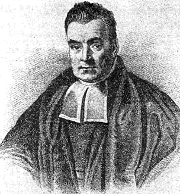

--- 
title: "Advanced Statistical Methods"
subtitle: "Bayesian Statistics"
author: "Dr Lincoln Colling"
site: bookdown::bookdown_site
documentclass: book
description: |
  An introduction to Bayesian Statistics
---

# Preface {-}

```{r, echo = FALSE, fig.align = "center"}

```

The aim of this course is to give you an introduction to Bayesian statistics.
It is by no means intended to be an exhaustive course, so at the end of it,
there will still be a lot for you to learn. However, I do hope that at the end
of this workshop you’ll have a better understanding of Bayesian statistics, how
it differs from Frequentist approaches, and how to incorporate some Bayesian
methods into your research. 

In this course we'll primarily focus Bayesian hypothesis testing using Bayes
factors. We'll also discuss how Bayesian hypothesis testing differs from
Null-hypothesis significance testing. Bayesian hypothesis testing with Bayes
factors is just one of many approaches that could fall under the heading on
**Bayesian statistics**. Other approaches would include things like Bayesian
paramter estimation, and Bayesian regression modelling. These other approaches
are definitely worth learning, but there simply aren't within the scope of this
short workshop.

## How to use this book {-}

You can read through this book just like you would read through any course
notes. However, you're get the most out of it if you work along with the code.
To work along with the code click on one of the two badges that appear at the
start of each chapter.

The first badge will allow you to download the **RMarkdown** file that contains
all the code for the examples. You'll be able to load this up in **RStudio**.


The second badge will allow you to open the chapter in **Google Colab**. The
interface for **Google Colab** is similar to an **RMardown** document in that
it will contain code and text. However, you won't need **R** installed and
you'll be able to work with the file directly in your web browser. If you make
any changes to the document then you'll be able to save these directly in you
Google Drive account. You'll just need to login with a GMail account.


## Outline {-}

In the first part of this course will be a refresher on frequentist methods. In
particular, we’ll talk about the sampling distribution, where it comes from,
and how we do inference with it. Following this, we’ll cover some of the
features of sampling distributions that have been criticised by Bayesian. From
the sampling distribution, we’ll move on to likelihoods. We’ll see that
likelihoods don’t suffer from some of the problems of sampling distributions,
and we’ll see how to do inference with likelihoods.

Finally, we'll learn how to compute and interpret Bayes factors, and we'll 
learn about some of the considerations that go into specifying models for 
Bayes factors.
